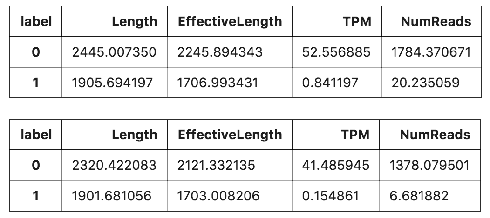
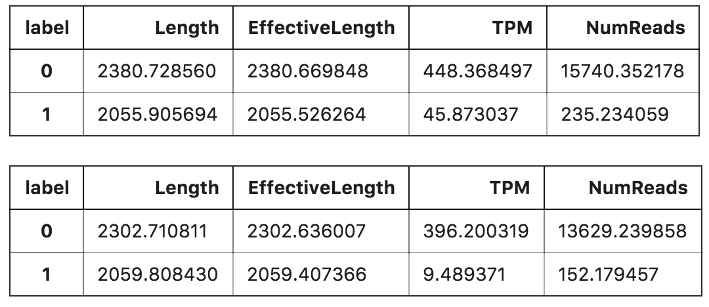
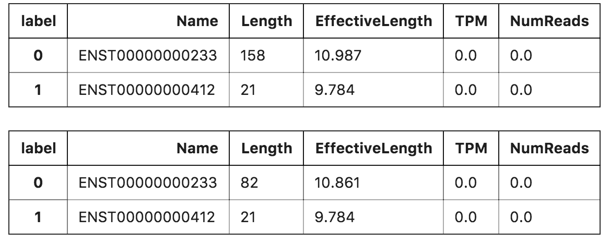

<!-- $theme: gaia -->
### Proj. 3
# Uncertainty Quantification
##### Team members: 
##### Zhengwei Wei, Chong Ou, 
##### Yunqing Yang, Haozhi Qu

---

## Project Description
Salmon is a tool for measuring gene expression, and gives estimates of transcript abundances. Using 'bootstrapping' technique, we can measure the confidence in these estimates. However, this approach tends to underestimate the uncertainty with more transcripts falling out of the interval than expected. 

Our goal is to <b>filter out these failed transcripts, find common properties between them</b>, and come up with a quality score based on those properties which measures our confidence in the estimates. 

---

## Our Approaches
1. Parse the data files (poly_truth.tsv, quant_bootstrap.tsv, quant.sf);
2. Find range of confidence interval;
3. Filter out the failed transcripts;
4. Group data by true/failed transcripts, analyze common properties.
---

## Implementation Details

---

## Parse quant_bootstraps.tsv
This file gives us the bootstrap data (200 rounds of sample taking).  
Note: we are using `DataFrame` from the `pandas` package to easier do data analysis.
```python
quant_bootstraps = tsv.TsvReader(open(root_path + 
				  "quant_bootstraps.tsv"))
quant_boot = [line for line in quant_bootstraps]
```
```python
df_quant_boot = pd.DataFrame.from_records(quant_boot[1:], 
				    columns=quant_boot[0])
```
---

## Parse poly_truth.tsv
This file gives us the true count of each transcript.
```python
# Poly_truth.tsv: true counts for each transcript
poly_truth = open(root_path + "poly_truth.tsv")
lines = poly_truth.readlines()
poly_truth.close()

poly_truth = [['transcript_id','count']]
poly_truth.extend(line[:-1].split('\t') for line in lines)
df_poly_truth = pd.DataFrame.from_records(poly_truth[1:], 
				    columns=poly_truth[0])
```
```python
df_poly_truth['transcript_id']=
		df_poly_truth['transcript_id'].astype(str)
df_poly_truth['count']=df_poly_truth['count'].astype(int)
```

---

We find and retrieve the intersecting transcript ids of poly_truth and quant_bootstraps, and sort each id's data by ascending order. There are transcripts in quant_bootstraps that don't show up in poly_truth, we'll deal with them later.
```python
set_qb_id = set(df_quant_boot.columns)
set_pt_id = set(df_poly_truth.transcript_id)
intersect_ids = set_qb_id & set_pt_id 

sort_qb = []
use_id = []
for id in intersect_ids:
    listed = list(df_quant_boot[id])
    listed.sort()
    use_id.append(id)
    sort_qb.append(listed)
sort_qb = list(map(list,zip(*sort_qb)))
```
---
## Find confidence interval
Since we have already sorted each transcript id's data, we can find an empirical confidence interval of 95% by locating the numbers at index `(total_length) * 2.5%` and `(total_length) * 97.5%`, which would be the lower and upper bound.
```python
df_poly_truth = df_poly_truth.set_index(['transcript_id'])

sum = len(sort_qb)
percent2dot5 = df_qb_sorted.loc[int(sum*0.025)-1]
percent97dot5 = df_qb_sorted.loc[int(sum*0.975)-1]
```
---
## Find the failed transcripts  
Compare the counts given by poly_truth with the lower and upper bound we found earlier. If not in range we treat it as a failed transcript, else true.
```python
true_id = []
false_id = []
for id in use_id:
    down = float(percent2dot5[id])
    up = float(percent97dot5[id])
    true_count = float(df_poly_truth.loc[id])
    if down < true_count < up: 
        true_id.append(id)
    else: 
        false_id.append(id)
```
---
We go back to deal with the 'diff' transcript ids we ignored earlier. The counts of these diff transcript ids are zero, and we assume that these are true transcripts.
```python
true_id.extend(list(set_qb_id.difference(set_pt_id)))
all_id = true_id[:]
all_id.extend(false_id)
```
We add a label of 1 representing true transcripts and 0 representing failed transcripts for easy grouping later on.
```python
label = [1 if i < len(true_id) else 0 for i in 
		      range(len(true_id) + len(false_id))]
labeled_id = [all_id,label]
labeled = list(map(list,zip(*labeled_id)))
```
---
## Parse quant.sf
This file gives us some attributes of the transcripts.


```python
quant_file = open(root_path + "quant.sf")
lines = quant_file.readlines()
quant_file.close()
quant = [line[:-1].split('\t') for line in lines]
```
```python
df_quant = pd.DataFrame.from_records(quant[1:], 
					 columns=quant[0])
df_quant.Name = df_quant.Name.astype(str)
df_quant.Length = df_quant.Length.astype(int)
df_quant.EffectiveLength = df_quant.EffectiveLength.astype
						   (float)
df_quant.TPM = df_quant.TPM.astype(float)
df_quant.NumReads = df_quant.NumReads.astype(float)
```
---

## Find common properties of failed transcripts

We group the data by true and failed transcripts, and observe the mean, std, max and min.  

---

Observing the mean, the average TPM and NumReads of failed transcripts is a lot bigger than the true ones.  



---

With the std, we find that failed transcripts tend to have a significantly larger variance of TPM and NumReads.  



---

Min values don't seem to have much to offer other than maybe a slightly bigger length.



---

With max values, failed transcripts seems to never have very long lengths and effective lengths.

The TPM and NumReads attributes also seem interesting, which given the info from std, tells us that failed transcripts have:
-- a wider range of TPM with wide variance;
-- a narrow range of NumReads with wide variance.


